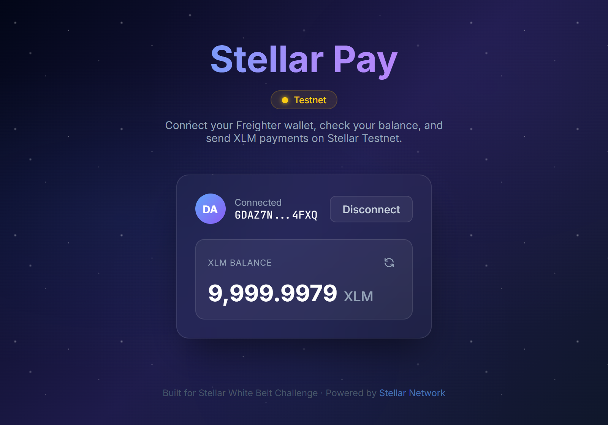
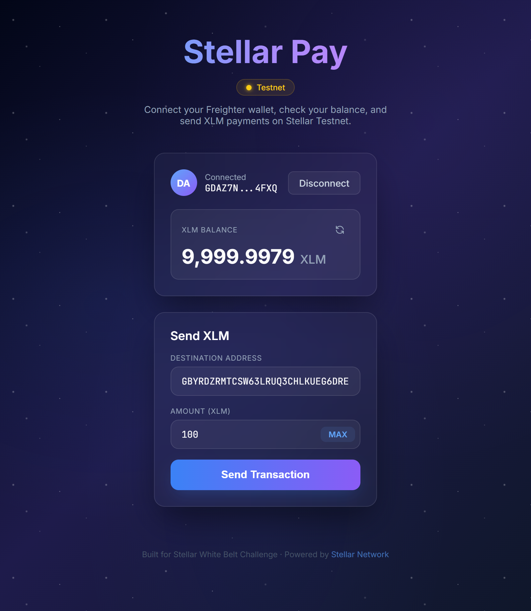

# Stellar Pay + Vote

A multi-wallet dApp built on the **Stellar Testnet** with XLM payments and on-chain voting via a Soroban smart contract.

Built as a **Level 2 (Yellow Belt)** project for the Stellar dApp development course.

## Features

### Multi-Wallet Integration (StellarWalletsKit)
- **4 wallet options** — Freighter, xBull, Albedo, LOBSTR
- Unified auth modal for wallet selection
- Connect/disconnect with any supported wallet

### Smart Contract (Soroban)
- **Poll contract** deployed on Stellar Testnet
- Create polls with 2-4 options
- Cast votes (one vote per address, enforced on-chain)
- Read poll data (question, options, vote counts)
- Events emitted on every vote

### Error Handling (3 types)
1. **WalletNotFoundError** — wallet extension not installed
2. **TransactionRejectedError** — user cancelled signing
3. **InsufficientBalanceError** — not enough XLM

### Transaction Status Tracking
- Real-time status: Building → Signing → Submitting → Success/Fail
- Transaction hash with Stellar Expert link

### Real-Time Event Feed
- Polls Soroban RPC every 5 seconds for contract events
- Live event feed showing vote activity

### XLM Payments (White Belt)
- Send XLM to any Stellar address
- Balance display with refresh
- Friendbot integration for testnet funding

## Tech Stack

| Layer | Technology |
|-------|-----------|
| Framework | Next.js 16 (App Router) + TypeScript |
| Styling | Tailwind CSS 4 |
| Multi-Wallet | @creit.tech/stellar-wallets-kit v2.1.0 |
| Blockchain | @stellar/stellar-sdk v15 (Horizon + Soroban RPC) |
| Smart Contract | Soroban (Rust) |

## Contract Info

| Item | Value |
|------|-------|
| Contract ID | `PLACEHOLDER_CONTRACT_ID` |
| Network | Stellar Testnet |
| RPC URL | `https://soroban-testnet.stellar.org` |
| Transaction Hash | `PLACEHOLDER_TX_HASH` |

## Prerequisites

- [Node.js](https://nodejs.org/) v18+
- A Stellar wallet browser extension (Freighter, xBull, Albedo, or LOBSTR)
- For contract deployment: [Rust](https://rustup.rs/) + [Stellar CLI](https://github.com/stellar/stellar-cli)

## Setup Instructions

### 1. Clone the repository

```bash
git clone https://github.com/go99further/stellar-pay.git
cd stellar-pay
```

### 2. Install dependencies

```bash
npm install
```

### 3. Configure environment

```bash
cp .env.example .env.local
# Edit .env.local with your deployed contract ID
```

### 4. Run the development server

```bash
npm run dev
```

Open [http://localhost:3000](http://localhost:3000) in your browser.

### 5. Deploy the Smart Contract (optional)

```bash
cd contracts/poll
stellar contract build
stellar contract deploy \
  --wasm target/wasm32v1-none/release/poll_contract.wasm \
  --network testnet \
  --source <YOUR_SECRET_KEY>
```

## Screenshots

### Wallet Options Available


### Balance Displayed


### Send XLM Transaction


### Transaction Result


## Project Structure

```
stellar-pay/
├── app/
│   ├── layout.tsx              # Root layout
│   ├── page.tsx                # Main page (Tab: Pay / Vote)
│   └── globals.css             # Global styles + animations
├── components/
│   ├── WalletConnect.tsx       # Multi-wallet connect (StellarWalletsKit)
│   ├── BalanceDisplay.tsx      # XLM balance display
│   ├── SendPayment.tsx         # Payment form
│   ├── TransactionResult.tsx   # Transaction result display
│   └── poll/
│       ├── PollCard.tsx        # Voting UI + transaction status
│       ├── PollResults.tsx     # Live results bar chart
│       └── EventFeed.tsx       # Real-time event stream
├── context/
│   └── WalletContext.tsx       # Wallet state management
├── hooks/
│   ├── usePollContract.ts      # Contract read/write hook
│   └── useContractEvents.ts    # Event polling hook
├── lib/
│   ├── stellar.ts              # Horizon SDK (balance, payments)
│   ├── wallet-kit.ts           # StellarWalletsKit initialization
│   ├── poll-contract.ts        # Soroban RPC contract calls
│   └── errors.ts               # 3 typed error classes
├── contracts/poll/
│   ├── Cargo.toml              # Rust project config
│   └── src/lib.rs              # Soroban poll contract
└── .env.example                # Environment template
```

## Error Handling

| Error Type | Trigger | User Message |
|-----------|---------|--------------|
| WalletNotFoundError | No wallet extension detected | "Please install Freighter, xBull, or Albedo" |
| TransactionRejectedError | User cancels wallet popup | "Transaction was rejected or cancelled" |
| InsufficientBalanceError | Balance too low | "Insufficient balance. Required: X XLM" |

## License

MIT
