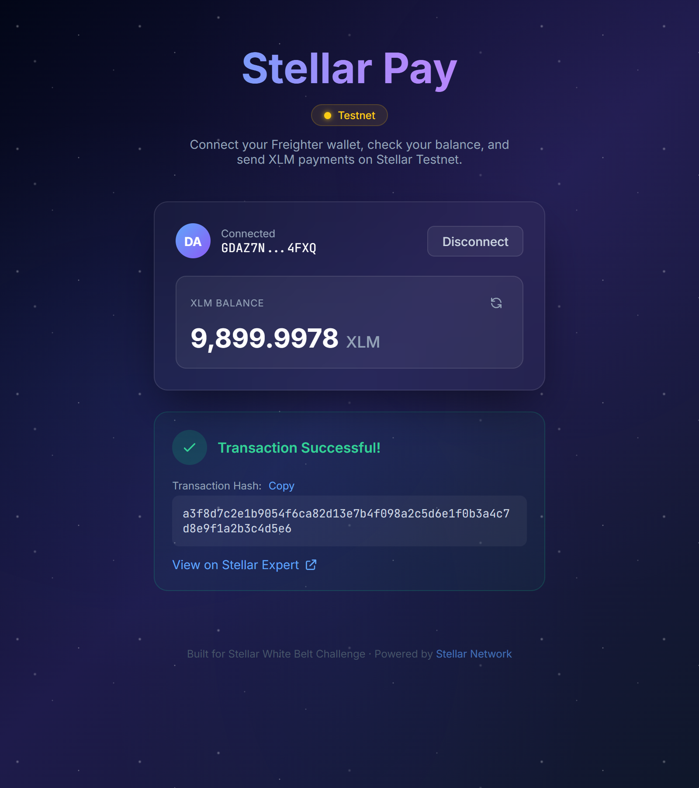

# Stellar Pay

A simple payment dApp built on the **Stellar Testnet**. Connect your Freighter wallet, view your XLM balance, and send XLM transactions — all from a clean, modern UI.

Built as a **Level 1 (White Belt)** project for the Stellar dApp development course.

## Features

- **Wallet Connection** — Connect and disconnect your Freighter browser wallet
- **Balance Display** — View your XLM balance in real-time with refresh support
- **Send Payments** — Send XLM to any Stellar address on testnet
- **Transaction Feedback** — See success/failure status with transaction hash and Stellar Expert link
- **Friendbot Integration** — One-click funding for new testnet accounts (10,000 XLM)
- **Error Handling** — Clear error messages for invalid addresses, insufficient balance, etc.

## Tech Stack

| Layer | Technology |
|-------|-----------|
| Framework | Next.js 15 (App Router) + TypeScript |
| Styling | Tailwind CSS |
| Wallet | @stellar/freighter-api v6 |
| Blockchain | @stellar/stellar-sdk (Horizon Testnet) |

## Prerequisites

- [Node.js](https://nodejs.org/) v18 or later
- [Freighter Wallet](https://www.freighter.app/) browser extension installed
- Freighter set to **Testnet** network

## Setup Instructions

### 1. Clone the repository

```bash
git clone https://github.com/go99further/stellar-pay.git
cd stellar-pay
```

### 2. Install dependencies

```bash
npm install
```

### 3. Run the development server

```bash
npm run dev
```

Open [http://localhost:3000](http://localhost:3000) in your browser.

### 4. Configure Freighter

1. Install the [Freighter browser extension](https://www.freighter.app/)
2. Create or import a wallet
3. Switch the network to **Testnet** in Freighter settings

### 5. Get Testnet XLM

After connecting your wallet, if your balance is 0, click the **"Fund with Friendbot"** button to receive 10,000 test XLM.

## Screenshots

### Wallet Connected State
<!-- Add screenshot here -->


### Balance Displayed
<!-- Add screenshot here -->


### Successful Testnet Transaction
<!-- Add screenshot here -->


### Transaction Result Shown to User
<!-- Add screenshot here -->


## Project Structure

```
stellar-pay/
├── app/
│   ├── layout.tsx          # Root layout with fonts and metadata
│   ├── page.tsx            # Main page with state management
│   └── globals.css         # Global styles + star animations
├── components/
│   ├── WalletConnect.tsx   # Wallet connect/disconnect UI
│   ├── BalanceDisplay.tsx  # XLM balance display with refresh
│   ├── SendPayment.tsx     # Payment form with validation
│   └── TransactionResult.tsx # Transaction result display
├── lib/
│   ├── stellar.ts          # Stellar SDK: balance, payments, friendbot
│   └── freighter.ts        # Freighter wallet integration
└── README.md
```

## Network Configuration

| Parameter | Value |
|-----------|-------|
| Network | Stellar Testnet |
| Horizon URL | https://horizon-testnet.stellar.org |
| Network Passphrase | `Test SDF Network ; September 2015` |
| Friendbot | https://friendbot.stellar.org |

## License

MIT
