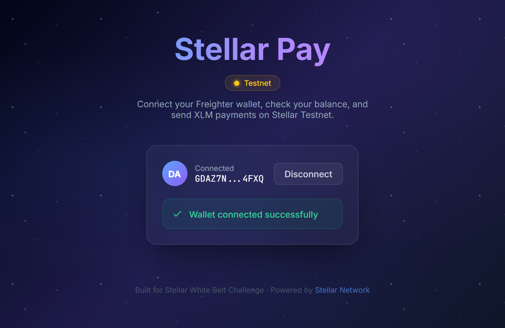
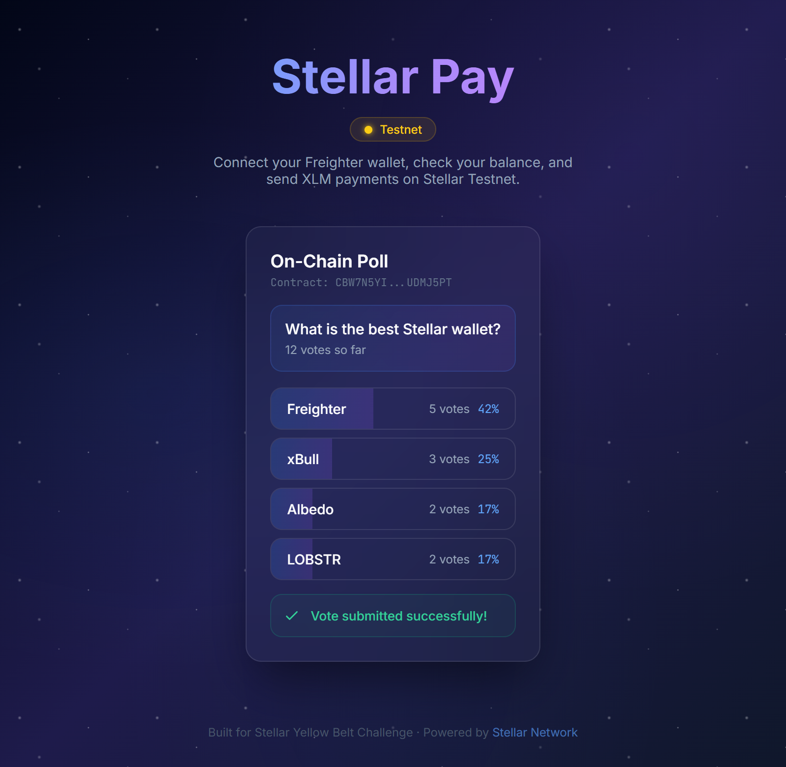
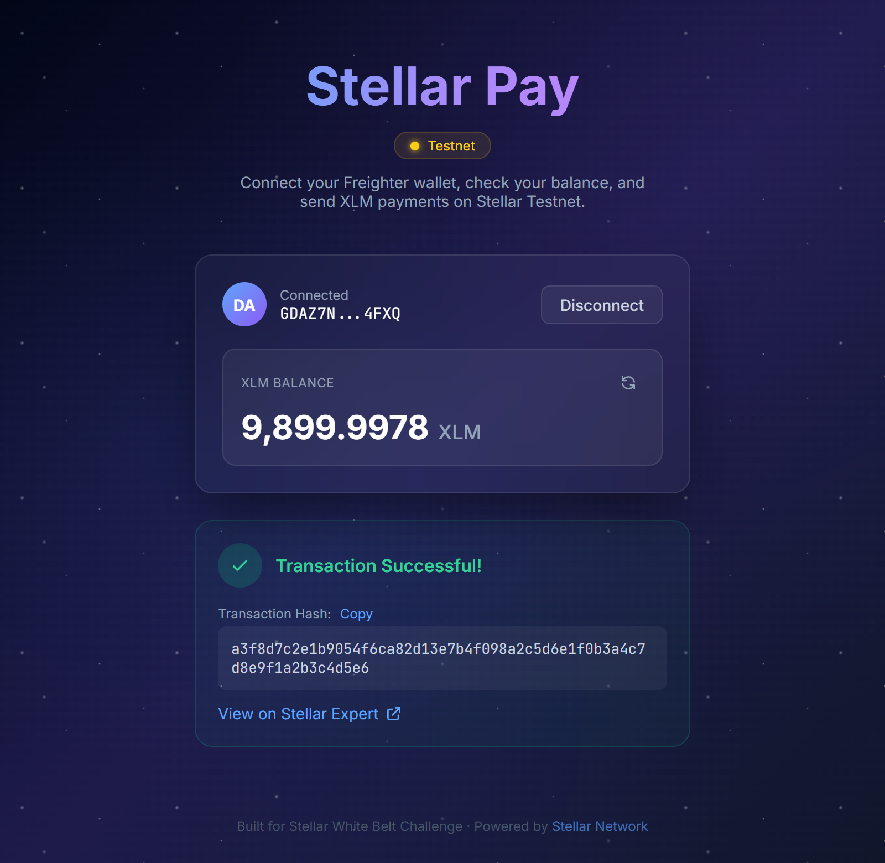

# Stellar Pay + Vote

[](https://github.com/go99further/stellar-pay/actions/workflows/ci.yml)

A multi-wallet dApp built on the **Stellar Testnet** with XLM payments, on-chain voting, and a custom **RewardToken** — two Soroban smart contracts with cross-contract calls.

Built as a **Level 4 (Green Belt)** project for the Stellar dApp development course.

## Live Demo

> Deployed on Vercel: [stellar-pay.vercel.app](https://stellar-pay.vercel.app) *(connect a Stellar wallet to use)*

## Features

### Multi-Wallet Integration (StellarWalletsKit)
- **4 wallet options** — Freighter, xBull, Albedo, LOBSTR
- Unified auth modal for wallet selection
- Connect/disconnect with any supported wallet

### Two Soroban Smart Contracts (Cross-Contract Calls)
- **Poll contract** — create polls, cast votes (one per address, on-chain enforced), live results
- **RewardToken contract** — custom `VOTE` token minted as reward for voting
- **Cross-contract call**: `Poll.vote()` calls `RewardToken.mint()` to reward the voter automatically

### Reward Token (VOTE)
- Custom SPL-style token implemented in Soroban (Rust)
- `initialize`, `mint`, `transfer`, `balance`, `name`, `symbol`, `total_supply`
- Token balance displayed live in the wallet card

### Error Handling (3 types)
1. **WalletNotFoundError** — wallet extension not installed
2. **TransactionRejectedError** — user cancelled signing
3. **InsufficientBalanceError** — not enough XLM

### Transaction Status Tracking
- Real-time status: Building → Signing → Submitting → Success/Fail
- Transaction hash with Stellar Expert link

### Caching Layer
- In-memory cache with TTL for poll data and balances
- Static data cached for 2 minutes; vote counts for 10 seconds
- Automatic cache invalidation after voting

### Real-Time Event Feed
- Polls Soroban RPC every 5 seconds for contract events
- Live event feed showing vote activity

### XLM Payments
- Send XLM to any Stellar address
- Balance display with refresh
- Friendbot integration for testnet funding

## Tech Stack

| Layer | Technology |
|-------|-----------|
| Framework | Next.js 16 (App Router) + TypeScript |
| Styling | Tailwind CSS 4 |
| Multi-Wallet | @creit.tech/stellar-wallets-kit v2.1.0 |
| Blockchain | @stellar/stellar-sdk v15 (Horizon + Soroban RPC) |
| Smart Contracts | Soroban (Rust) — Poll + RewardToken |
| CI/CD | GitHub Actions |
| Deploy | Vercel |
| Testing | Vitest + Testing Library |

## Contract Info

| Item | Value |
|------|-------|
| Poll Contract ID | `CC5SFU56BFW6XLJCV6TWMH2A24SZWVWIYZJBXTBTJCP3TREZYGZUGCPW` |
| RewardToken Contract ID | `CCU2IKALLSXH5IFFFOVZNDHNY2B6LIEIGBBLOJABPCLEKCEWICE347UP` |
| Network | Stellar Testnet |
| RPC URL | `https://soroban-testnet.stellar.org` |
| Poll Deploy TX | `faca2f62bf765e9a95bde6e97f3760ece206b03df2ababd14feebb1c568da89a` |
| RewardToken Deploy TX | `440d7727a4e2ca2462bb943545f21b05a40def7911ddb9975c7284be2ba0df53` |

## Prerequisites

- [Node.js](https://nodejs.org/) v18+
- A Stellar wallet browser extension (Freighter, xBull, Albedo, or LOBSTR)
- For contract deployment: [Rust](https://rustup.rs/) + wasm32-unknown-unknown target

## Setup Instructions

### 1. Clone the repository

```bash
git clone https://github.com/go99further/stellar-pay.git
cd stellar-pay
```

### 2. Install dependencies

```bash
npm install
```

### 3. Configure environment

```bash
cp .env.example .env.local
# Edit .env.local with the deployed contract IDs
```

`.env.local`:
```
NEXT_PUBLIC_CONTRACT_ID=CC5SFU56BFW6XLJCV6TWMH2A24SZWVWIYZJBXTBTJCP3TREZYGZUGCPW
NEXT_PUBLIC_REWARD_TOKEN_ID=CCU2IKALLSXH5IFFFOVZNDHNY2B6LIEIGBBLOJABPCLEKCEWICE347UP
NEXT_PUBLIC_SOROBAN_RPC_URL=https://soroban-testnet.stellar.org
```

### 4. Run the development server

```bash
npm run dev
```

Open [http://localhost:3000](http://localhost:3000) in your browser.

### 5. Run tests

```bash
npm test
```

### 6. Deploy both contracts (optional)

```bash
node scripts/deploy-all.js
```

This script uploads both WASM files, creates both contracts with unique salts, initializes them, extends their TTL, and creates the first poll. It prints the contract IDs and `.env.local` values at the end.

## CI/CD Pipeline

GitHub Actions runs on every push to `main`:
1. Install Node.js dependencies
2. Run tests (`npm test`)
3. Build the Next.js app (`npm run build`)
4. Lint (`npm run lint`)

See [`.github/workflows/ci.yml`](.github/workflows/ci.yml).

## Testing

19 tests across 3 test suites, all passing:

| Suite | Tests | Description |
|-------|-------|-------------|
| `cache.test.ts` | 9 | Cache set/get, TTL expiry, invalidation, complex objects |
| `errors.test.ts` | 6 | Error classification for 3 error types + display helpers |
| `validation.test.ts` | 4 | Stellar address validation, amount validation, MAX calculation |

Run tests:
```bash
npm test          # single run
npm run test:watch  # watch mode
```

## Screenshots

### Wallet Connected with Reward Token Balance


### On-Chain Poll with Live Results


### Transaction Result


## Project Structure

```
stellar-pay/
├── app/
│   ├── layout.tsx              # Root layout
│   ├── page.tsx                # Main page (Tab: Pay / Vote)
│   └── globals.css             # Global styles + animations
├── __tests__/
│   ├── cache.test.ts           # Cache layer tests (9 tests)
│   ├── errors.test.ts          # Error classification tests (6 tests)
│   └── validation.test.ts      # Input validation tests (4 tests)
├── components/
│   ├── WalletConnect.tsx       # Multi-wallet connect (StellarWalletsKit)
│   ├── BalanceDisplay.tsx      # XLM balance display
│   ├── SendPayment.tsx         # Payment form
│   ├── TransactionResult.tsx   # Transaction result display
│   ├── RewardBadge.tsx         # VOTE token balance display
│   └── poll/
│       ├── PollCard.tsx        # Voting UI + transaction status
│       ├── PollResults.tsx     # Live results bar chart
│       └── EventFeed.tsx       # Real-time event stream
├── context/
│   └── WalletContext.tsx       # Wallet state management
├── hooks/
│   ├── usePollContract.ts      # Contract read/write hook (with cache)
│   └── useContractEvents.ts    # Event polling hook
├── lib/
│   ├── stellar.ts              # Horizon SDK (balance, payments)
│   ├── wallet-kit.ts           # StellarWalletsKit initialization
│   ├── poll-contract.ts        # Soroban RPC contract calls
│   ├── reward-token.ts         # RewardToken contract calls
│   ├── cache.ts                # In-memory cache with TTL
│   └── errors.ts               # 3 typed error classes
├── contracts/
│   ├── poll/                   # Poll Soroban contract (Rust)
│   └── reward-token/           # RewardToken Soroban contract (Rust)
├── scripts/
│   └── deploy-all.js           # Deploy both contracts to testnet
├── .github/workflows/ci.yml    # GitHub Actions CI pipeline
├── vitest.config.ts            # Test configuration
└── .env.example                # Environment template
```

## Error Handling

| Error Type | Trigger | User Message |
|-----------|---------|--------------|
| WalletNotFoundError | No wallet extension detected | "Please install Freighter, xBull, or Albedo" |
| TransactionRejectedError | User cancels wallet popup | "Transaction was rejected or cancelled" |
| InsufficientBalanceError | Balance too low | "Insufficient balance. Required: X XLM" |

## License

MIT
