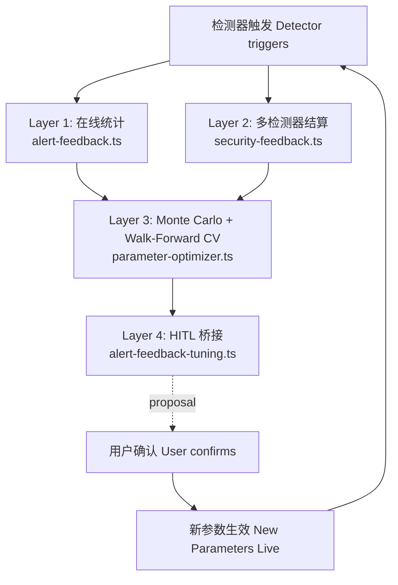

# 4 层数据闭环架构

> 受众：Web3 Agent 方向技术面试官，从 README 点进来，5 分钟内决定是否深问。

---

## 1. 问题陈述

多 Agent DeFi 系统的检测器依赖硬编码阈值。部署后没有反馈通道——误报了没人统计，
漏报了没人发现。这是一个开环系统：fire and forget。

没有闭环，阈值参数会随市场行为漂移，而我们无法察觉。Security Agent 可能声称
90% precision，实际在当前 regime 只有 50%——我们永远不会知道。

解法：在触发事件和阈值调整之间建立可观测的数据通路，每一步都有不变量约束，
每一步都有测试覆盖，参数变更必须经过人工确认才能生效。

---

## 2. 4 层架构图



| 层 | 文件 | 公开 API | 职责 | 关键不变量 |
|----|------|----------|------|-----------|
| L1 | `alert-feedback.ts` | `recordTrigger` / `recordOutcome` / `getOnlineStats` | 价格警报触发→结算→在线命中率 | `observedAt > triggeredAt` 才结算 |
| L2 | `security-feedback.ts` | `settleByExecutedSwap` / `settleByTvlChange` / `settleBySandwichBehavior` / `settleAllPending` | 三个检测器各自的结算规则 + stats | `suggestSecurityThresholds` 只读不写 |
| L3 | `parameter-optimizer.ts` | `monteCarloSearch` / `walkForwardOptimize` | 500 iter Monte Carlo + 60/20/20 walk-forward | 同种子同结果（mulberry32） |
| L4 | `alert-feedback-tuning.ts` | `tuneSuggestionParams` / `getSuggestionParams` / `setSuggestionParams` | 把 L3 输出桥接到 L1 的决策参数 | 过拟合时拒绝持久化 |

---

## 3. Layer 1：alert-feedback.ts

### 数据流

触发时，`recordTrigger` 写入一条 `outcome: "pending"` 记录到 localStorage：

```typescript
// alert-feedback.ts:106
export function recordTrigger(
  alert: Pick<PriceAlert, "id" | "tokenPair" | "condition" | "targetPrice">,
  triggerPrice: number,
  now: number = Date.now()
): FeedbackRecord {
  const record: FeedbackRecord = { ...alert, triggeredAt: now, outcome: "pending" };
  const all = readAll();
  all.push(record);
  writeAll(all);
  return record;
}
```

30 秒后，下一次价格轮询调用 `recordOutcome`，用观察到的价格结算所有 pending 记录：

```typescript
// alert-feedback.ts:140
export function recordOutcome(
  observedPrice: number,
  observedAt: number = Date.now()
): FeedbackRecord[] {
  const all = readAll();
  let changed = false;
  const updated = all.map((rec) => {
    if (rec.outcome !== "pending") return rec;   // 幂等：已结算不再动
    if (observedAt <= rec.triggeredAt) return rec; // 无前瞻：拒收同时或更早的价格
    const hit = rec.condition === "above"
      ? observedPrice >= rec.triggerPrice
      : observedPrice <= rec.triggerPrice;
    changed = true;
    return { ...rec, outcome: hit ? "hit" : "miss", settledAt: observedAt };
  });
  if (changed) writeAll(updated);
  return updated.filter((r) => r.settledAt === observedAt);
}
```

### 不变量

**No future-leak**：`alert-feedback.ts:148` 的 `if (observedAt <= rec.triggeredAt) return rec`
确保结算价格必须严格晚于触发时刻。测试覆盖：
`__tests__/alert-feedback.test.ts` — "does not settle from a stale or simultaneous observation (no future-leak)"

**Idempotent settlement**：`alert-feedback.ts:147` 的 `if (rec.outcome !== "pending") return rec`
确保已结算记录不会被后续价格改写。测试覆盖：
`__tests__/alert-feedback.test.ts` — "only settles each pending record once"

### Settle 接入点

`hooks/usePriceAlerts.ts:90-91` 在每次 30 秒轮询拿到新价格后立即调用：

```typescript
recordOutcome(priceAtoB, observedAt);   // usePriceAlerts.ts:90
recordOutcome(priceBtoA, observedAt);   // usePriceAlerts.ts:91
```

两个方向都结算，因为警报可以是 TKNA/TKNB 或 TKNB/TKNA 任意方向。

### 输出

`getOnlineStats(alertId)` 返回：

```typescript
{ hits, misses, pending, hitRate, confidence }
// confidence: settled >= 5 → "high", 3-4 → "medium", else → "low"
```

`hitRate` 在 settled = 0 时返回 `null`，避免 0/0 = 100% 的误导性读数。

---

## 4. Layer 2：security-feedback.ts

### 三个检测器，三种结算规则

| 检测器 | Settler 函数 | 结算规则（file:line） | 接入点 |
|--------|-------------|----------------------|--------|
| `price_impact` | `settleByExecutedSwap` | `security-feedback.ts:167`：`\|实际滑点 - 预测\| / 预测 ≤ 20%` → confirmed，否则 false_positive | `app/agent/page.tsx:233`，用户确认 swap 后 |
| `liquidity_flow` | `settleByTvlChange` | `security-feedback.ts:216`：触发 1 小时后，`currentTvl < tvlAtTrigger × 0.95` → confirmed | `hooks/usePriceAlerts.ts` 30s 轮询，经 `settleAllPending` |
| `sandwich` | `settleBySandwichBehavior` | `security-feedback.ts:265`：触发 10 ledger 后，嫌疑地址有反向 round-trip 且 `amountOut > amountIn` → confirmed | `hooks/usePriceAlerts.ts` 30s 轮询，经 `settleAllPending` |

`settleByExecutedSwap` 的结算逻辑（`security-feedback.ts:167`）：

```typescript
export function settleByExecutedSwap(
  actualImpactPct: number,
  observedAt: number
): SecurityFeedbackRecord[] {
  const all = readAll();
  const updated = all.map((rec) => {
    if (rec.outcome !== "pending") return rec;
    if (rec.detectorType !== "price_impact") return rec;
    if (observedAt <= rec.triggeredAt) return rec;
    const relativeError = Math.abs(actualImpactPct - predicted) / Math.abs(predicted);
    const outcome = relativeError <= 0.2 ? "confirmed" : "false_positive";
    return { ...rec, outcome, settledAt: observedAt };
  });
  // ...
}
```

调用点在 `app/agent/page.tsx:233`，用户点击确认 swap 后：

```typescript
// app/agent/page.tsx:229-234
if (pendingXdr.operationType === "swap" && pendingXdr.details) {
  const details = pendingXdr.details as { amountIn?: number; amountOut?: number; estimatedOut?: number };
  if (details.estimatedOut && details.amountOut) {
    const actualImpact = Math.abs(details.estimatedOut - details.amountOut) / details.estimatedOut * 100;
    settleByExecutedSwap(actualImpact, Date.now());
  }
}
```

### expirePending：24 小时超时

`expirePending` 把超过 24 小时仍 pending 的记录标为 `"expired"`，而不是让它们永远
挂在 localStorage 里。关键细节：`expirationRate` 单独上报，不混入 `precision` 计算。

```typescript
// security-feedback.ts:408-409（getSecurityStats 内）
precision = confirmed + falsePositives > 0
  ? confirmed / (confirmed + falsePositives)
  : null;
expirationRate = records.length > 0 ? expired / records.length : 0;
```

当 `expirationRate > 30%` 时，UI 应标记 precision 不可信——大量 expired 意味着
检测器触发了很多事件，但没有足够的后续数据来结算，precision 的分母被人为缩小了。

### 不变量

Layer 2 继承 Layer 1 的三条不变量，并增加第四条：

1. **No future-leak**：三个 settler 都有 `if (observedAt <= rec.triggeredAt) return rec`
2. **Idempotent settlement**：三个 settler 都有 `if (rec.outcome !== "pending") return rec`
3. **HITL only**：`suggestSecurityThresholds` 只返回建议对象，不修改任何状态
4. **Read-only suggestions**：`suggestSecurityThresholds` 从不 mutate `THRESHOLDS` import。
   测试覆盖：`__tests__/security-feedback.test.ts` — "suggestSecurityThresholds does not mutate THRESHOLDS"

---

## 5. Layer 3：parameter-optimizer.ts

### 为什么 walk-forward 而不是 k-fold

价格序列是时间序列数据。随机 k-fold 会把未来数据混入训练集——比如用第 80 笔交易
的价格来训练预测第 20 笔交易的参数，这是前瞻偏差。`walkForwardOptimize`
（`parameter-optimizer.ts:319`）使用严格的 60/20/20 时间切分：前 60% 训练，
接下来 20% 验证，最后 20% 测试，三段不重叠，测试集只跑一次。

### Monte Carlo 流程

```
monteCarloSearch（parameter-optimizer.ts:190）
  iterations = 1000（默认），每次：
    1. 从 ParamSpace 随机采样一组参数
    2. 从数据序列随机采样 50 个 windowSize=50 的窗口
    3. 对每个窗口运行 SimulateFn，聚合 hits/misses/falseAlarms
    4. score = hits × 1 + misses × (−0.5) + falseAlarms × (−0.3)
  排序后取 top-5%，对这批候选参数逐 key 计算 p25/p50/p75
  输出：recommended（p50）+ confidenceInterval（p25/p75）
```

`tuneSuggestionParams`（`alert-feedback-tuning.ts:294`）调用时使用
`iterations: 500, seed: 42`，比默认少一半迭代以控制运行时间，但种子固定保证可复现。

### 种子化 PRNG（mulberry32）

```typescript
// parameter-optimizer.ts:92
export function mulberry32(seed: number): () => number {
  let a = seed >>> 0;
  return function () {
    a = (a + 0x6d2b79f5) >>> 0;
    // ... 位运算混淆
    return ((t ^ (t >>> 14)) >>> 0) / 4294967296;
  };
}
```

同种子同序列，CI 环境和本地开发跑出的推荐参数完全一致，面试 demo 可复现。

### 输出结构

```typescript
// WalkForwardReport<P>（parameter-optimizer.ts:78）
{
  recommended: P,                          // top-5% 的 p50
  confidenceInterval: { p25: P, p75: P }, // IQR
  trainScore: number,
  validationScore: number,
  testScore: number,
  overfitFlag: boolean,  // testScore < 0.5 × trainScore 时为 true
  message: string,
}
```

`overfitFlag` 触发条件（`parameter-optimizer.ts:372`）：
`trainScore > 0 && testScore < trainScore * 0.5 && |trainScore - testScore| > 1`。
Layer 4 在 `overfitFlag = true` 时拒绝持久化，返回 `success: false`。

---

## 6. Layer 4：alert-feedback-tuning.ts

### 为什么需要桥接层

`suggestThreshold`（`alert-feedback.ts:231`）原来有 5 个硬编码魔法数字：

```typescript
onlineWeight = 0.6      // 在线命中率的权重
keepThreshold = 0.75    // 综合准确率 ≥ 此值 → keep
tightenThreshold = 0.5  // 综合准确率 < 此值 → tighten
tightenDelta = 0.05     // tighten 时移动目标价的幅度
loosenDelta = 0.03      // loosen 时移动目标价的幅度
```

桥接层把这 5 个值封装进 `SuggestionParams` 对象，通过 `getSuggestionParams()`
从 localStorage 读取，默认值等于原来的硬编码值（向后兼容）。
`tuneSuggestionParams` 用 L3 的优化器找到更好的值后，经用户确认再调用
`setSuggestionParams` 持久化。

### Simulator 内联真实决策树

`alert-feedback-tuning.ts:140-148` 的注释记录了一次重要重构：

```
// 之前这里是一个 shadow simulator（用中位数模拟触发），和 suggestThreshold 的
// 真实逻辑不同。Issue 2 重构：现在 simulator 内联了 suggestThreshold 的完整
// 决策树（combined accuracy → keep/tighten/loosen）...
// 这保证了优化器找到的参数和真实闭环使用的是同一套逻辑。
```

`simulateSuggestion`（`alert-feedback-tuning.ts:149`）内联了完整决策树：
先用窗口前 60% 模拟离线回测准确率，再用后 40% 模拟在线触发和结算，
然后用参数化的 `keepThreshold`/`tightenThreshold` 做 keep/tighten/loosen 决策，
计算 hits/misses/falseAlarms。优化器找到的参数和真实部署路径完全一致。
修复 commit：`bccf363`。

### 持久化与默认值

```typescript
// alert-feedback-tuning.ts:48
export const DEFAULT_PARAMS: SuggestionParams = {
  onlineWeight: 0.6, keepThreshold: 0.75, tightenThreshold: 0.5,
  tightenDelta: 0.05, loosenDelta: 0.03,
};
```

`getSuggestionParams()` 在 localStorage 为空、格式非法、或值超出范围时，
静默回退到 `DEFAULT_PARAMS`，不抛异常。`setSuggestionParams` 在写入前调用
`validateRanges`，确保 `tightenThreshold < keepThreshold`。

---

## 7. 系统级不变量（K2 审计视角）

以下 4 条不变量贯穿全部 4 层，每条都有代码 enforcement 和测试覆盖：

### 1. No future-leak（禁止前瞻偏差）

| 文件 | 行 | 代码 |
|------|----|------|
| `alert-feedback.ts` | 148 | `if (observedAt <= rec.triggeredAt) return rec` |
| `security-feedback.ts` | 176 | `if (observedAt <= rec.triggeredAt) return rec`（settleByExecutedSwap） |
| `security-feedback.ts` | 229 | `if (observedAt <= rec.triggeredAt) return rec`（settleByTvlChange） |

测试：`__tests__/alert-feedback.test.ts` — "does not settle from a stale or simultaneous observation (no future-leak)"

### 2. Idempotent settlement（结算幂等）

| 文件 | 行 | 代码 |
|------|----|------|
| `alert-feedback.ts` | 147 | `if (rec.outcome !== "pending") return rec` |
| `security-feedback.ts` | 174 | `if (rec.outcome !== "pending") return rec`（settleByExecutedSwap） |
| `security-feedback.ts` | 227 | `if (rec.outcome !== "pending") return rec`（settleByTvlChange） |
| `security-feedback.ts` | 279 | `if (rec.outcome !== "pending") return rec`（settleBySandwichBehavior） |

测试：`__tests__/alert-feedback.test.ts` — "only settles each pending record once"

### 3. HITL only（参数变更必须人工确认）

`suggestThreshold`（`alert-feedback.ts:231`）和 `suggestSecurityThresholds`
（`security-feedback.ts:441`）只返回建议对象，不修改任何 alert 或 threshold 状态。
`tuneSuggestionParams` 在 `overfitFlag = true` 时不调用 `setSuggestionParams`。

测试：`__tests__/alert-feedback.test.ts` — "never mutates the underlying alert object"

### 4. Read-only suggestions（建议函数不 mutate THRESHOLDS）

`suggestSecurityThresholds` 通过 `getCurrentThresholds` 读取 `THRESHOLDS` import，
计算建议值时只做算术，不赋值。`THRESHOLDS` 对象在整个函数调用前后保持不变。

测试：`__tests__/security-feedback.test.ts` — "suggestSecurityThresholds does not mutate THRESHOLDS"

---

## 8. 自我审查记录

开发完成后 code review 发现 3 个问题，每个都有可观测的症状、根因分析和修复。

### Issue 1：Security settler 写了但没接入前端轮询

**症状**：`settleByTvlChange` 和 `settleBySandwichBehavior` 在 `security-feedback.ts`
里定义完整，但 `hooks/usePriceAlerts.ts` 的 30 秒轮询只调用了 `recordOutcome`，
没有调用任何 security settler。结果：`liquidity_flow` 和 `sandwich` 的触发记录
永远停在 `pending` 状态，堆积在 localStorage，stats 里 pending 数字只增不减，
precision 永远是 `null`（没有 settled 样本）。

**根因**：Layer 2 的 settler 函数和 Layer 1 的 `recordOutcome` 是平行的，
但接入点只写了 Layer 1 的。Layer 2 的 `settleAllPending` orchestrator 存在，
但没有被任何前端代码调用。

**修复**：在 `hooks/usePriceAlerts.ts:100` 的 30 秒轮询里加入 `settleAllPending` 调用，
传入当前 reserves 作为 TVL proxy，同时触发 `expirePending`：

```typescript
// hooks/usePriceAlerts.ts:100-106
settleAllPending({
  tvlChange: { currentReserveA: reserveANum, currentReserveB: reserveBNum, observedAt },
  expireNow: observedAt,
});
```

同时在 `app/agent/page.tsx:233` 接入 `settleByExecutedSwap`，在用户确认 swap 后
用实际滑点结算 `price_impact` 记录。修复 commit：`9d76add`。

### Issue 2：参数优化器的 simulator 是 surrogate，不是真实逻辑

**症状**：`alert-feedback-tuning.ts` 里的 `simulateSuggestion` 最初用"价格中位数
模拟触发"——如果价格超过中位数就算 hit，否则算 miss。这和 `suggestThreshold`
的真实决策树（combined accuracy → keep/tighten/loosen）完全不同。

**根因**：优化器在一个不同的 landscape 上搜索参数，找到的 `onlineWeight`、
`keepThreshold` 等值是针对 surrogate 函数最优的，不是针对真实部署逻辑最优的。
部署后参数行为和优化器预测的行为不一致。

**修复**：重写 `simulateSuggestion`，内联完整的 `suggestThreshold` 决策树：
用窗口前 60% 模拟离线回测，后 40% 模拟在线触发和结算，然后用参数化阈值
做 keep/tighten/loosen 决策，计算真实的 hits/misses/falseAlarms。
优化器现在在和真实部署完全相同的 landscape 上搜索。
修复 commit：`bccf363` — "refactor: replace surrogate simulator with real suggestThreshold logic"

### Issue 3：expired 记录让 precision 虚高

**症状**：`getSecurityStats` 最初计算 `precision = confirmed / (confirmed + falsePositives)`，
分母里不包含 `expired`。如果大量记录因为 24 小时超时变成 `expired`，
这些记录从 precision 计算里消失，precision 的分母被人为缩小，
读数虚高——比如实际上 10 次触发里 3 confirmed、2 false_positive、5 expired，
precision 显示 3/5 = 60%，但有效样本率只有 50%。

**根因**：`expired` 是"无法结算"，不是"正确预测"。把它排除在分母外，
等于假装这些触发从未发生过。

**修复**：在 `SecurityStats` 里增加两个字段（`security-feedback.ts:66-67`）：

```typescript
expirationRate: number;       // expired / total
effectiveSampleRate: number;  // (confirmed + falsePositives) / total
```

`precision` 的计算逻辑不变（仍然只看 confirmed vs false_positive），
但 `expirationRate > 30%` 时 UI 应标记 precision 不可信。
修复 commit：`9d76add`。

---

## 9. 测试覆盖

| 层 | 测试文件 | `it()` 数量 | 关键覆盖点 |
|----|----------|------------|-----------|
| L1 | `__tests__/alert-feedback.test.ts` | 17 | no-future-leak、幂等结算、hitRate null、loosen/tighten/keep 建议、HITL 不 mutate |
| L2 | `__tests__/security-feedback.test.ts` | 29 | 三个 settler 各自的结算规则、expirePending、expirationRate、THRESHOLDS 不 mutate |
| L3 | `__tests__/parameter-optimizer.test.ts` | 12 | mulberry32 确定性、monteCarloSearch top-5%、walkForwardOptimize 60/20/20、overfitFlag |
| L4 | `__tests__/alert-feedback-tuning.test.ts` | 25 | DEFAULT_PARAMS 回退、validateRanges、simulator 决策路径、tuneSuggestionParams 过拟合拒绝 |
| **全项目** | 55 个测试文件 | **803** | 全部绿色 |

---

## 10. 限制与未来工作

- **Layer 1 结算窗口是 30 秒**：30 秒内发生的价格反转是噪声，无法捕获。
  对于高频交易场景，这个粒度不够细。

- **Sandwich 检测器的阈值建议逻辑存在单位混淆**：`suggestSecurityThresholds`
  对 sandwich 类型把 `sandwichWindowLedgers`（ledger 计数，整数）映射到 `medium`，
  把 `anomalyRemovalPct`（百分比，小数）映射到 `high`，然后对两者统一乘以 1.1 做
  "tighten"。这两个字段单位不同，10% 的调整对 ledger 计数和百分比的语义完全不同。
  已在代码注释中标注，待 ADR-7 决策后修复。

- **Analytics Agent 没有闭环**：Analytics Agent 的输出（流动性分析、价格预测）
  目前没有接入任何反馈通道。原因和设计决策记录在 `docs/DESIGN_DECISIONS.md` ADR-6。
